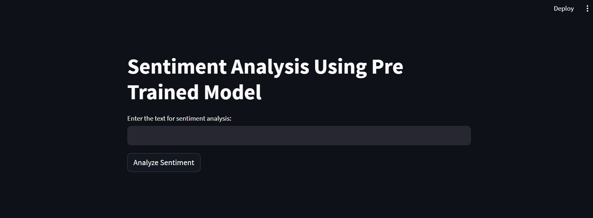

# Sentiment Analysis Web App



## Overview

This is a simple web application built using [Streamlit](https://streamlit.io/) for sentiment analysis of text. It uses the VADER (Valence Aware Dictionary and sEntiment Reasoner) sentiment analysis tool to determine whether the input text is positive, negative, or neutral.

## Features

- Analyze sentiment of input text.
- Provides sentiment scores for positive, negative, neutral, and compound sentiment.
- User-friendly web interface for text input and analysis.
- Real-time feedback on sentiment.

## Usage

1. Clone the repository:

   ```bash
   git clone https://github.com/harshbafnaa/sentiment-analysis.git
   ```

2. Navigate to the project directory:

   ```bash
   cd pre-trained-model
   ```

3. Install the required packages from the `requirements.txt` file:

   ```bash
   pip install -r requirements.txt
   ```

4. Run the Streamlit app:

   ```bash
   streamlit run sentiment_app.py
   ```

5. Open your web browser and go to the provided local URL (usually http://localhost:8501) to access the sentiment analysis app.

6. Enter the text you want to analyze in the input field and click the "Analyze Sentiment" button.

## Dependencies

- [Streamlit](https://streamlit.io/) - Used for creating the web interface.
- [vaderSentiment](https://github.com/cjhutto/vaderSentiment) - Used for sentiment analysis.

## File Structure

- `sentiment_app.py`: The main Streamlit application script.
- `requirements.txt`: List of required Python packages for the application.
- `screenshot.png`: Screenshot of the app for the README.

## Credits

- The sentiment analysis is powered by the VADER sentiment analysis tool.
